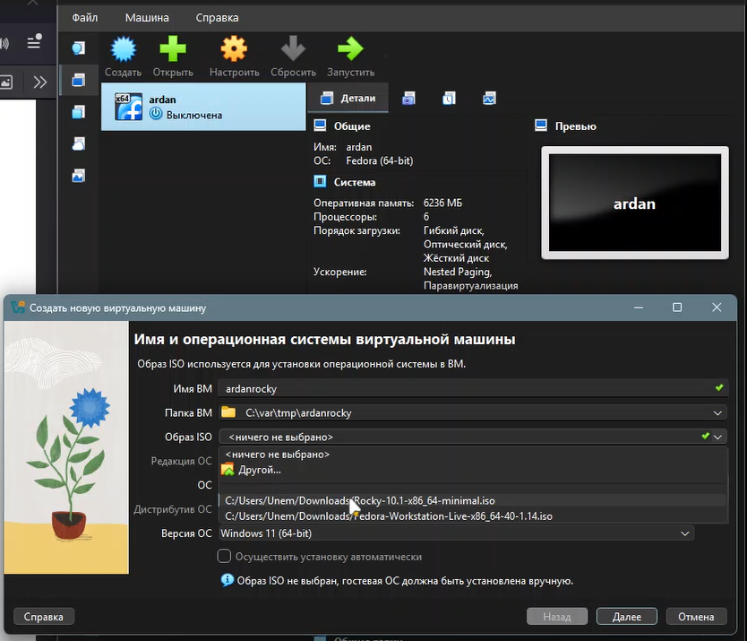
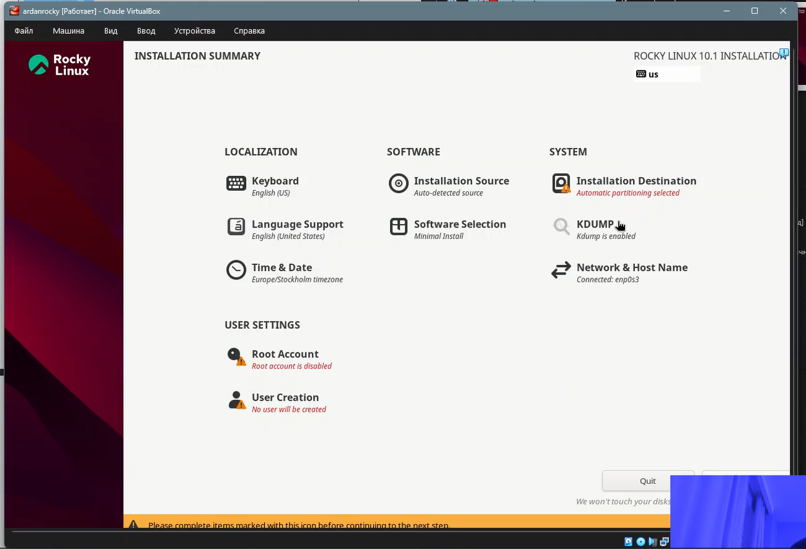

# Цель работы

Приобретение практических навыков установки операционной системы на виртуальную машину, настройки минимально необходимых для дальнейшей работы сервисов.

# Ход работы

- Установка Rocky
- Настройка
- Проверка
- Анализ через dmesg

# Создание операционной системы
 

# Настройка
 

# Выполнение проверок
 

# Выводы
В ходе выполнения лабораторной работы были приобретены практические навыки установки ОС Rocky Linux на виртуальную машину VirtualBox: создание виртуальной машины с заданными параметрами, установка ОС с выбором базового окружения Server with GUI, первоначальная настройка учётной записи пользователя и имени хоста. Дополнительно освоен анализ последовательности загрузки системы через журнал ядра (`dmesg`), позволяющий определить версию ядра, характеристики процессора, тип гипервизора и параметры монтирования файловых систем.
