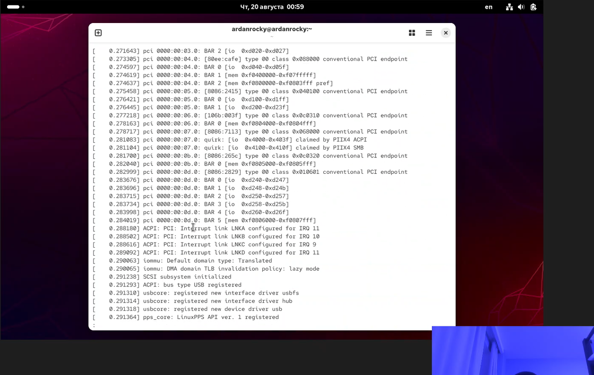

# Титульный лист
## РУДН
### Компьютерные и информационные науки, ФФМИЕН

\newpage

# 1. Цель работы
Приобретение практических навыков установки операционной системы на виртуальную машину, настройки минимально необходимых для дальнейшей работы сервисов.

# 2. Задание
Установить Rocky Linux на VirtualBox, настроить и проверить работоспособность

# 3.  

# 4.  

# 5.  

# 6. Выводы

В ходе выполнения лабораторной работы были приобретены практические навыки установки ОС Rocky Linux на виртуальную машину VirtualBox: создание виртуальной машины с заданными параметрами, установка ОС с выбором базового окружения Server with GUI, первоначальная настройка учётной записи пользователя и имени хоста. Дополнительно освоен анализ последовательности загрузки системы через журнал ядра (`dmesg`), позволяющий определить версию ядра, характеристики процессора, тип гипервизора и параметры монтирования файловых систем.
