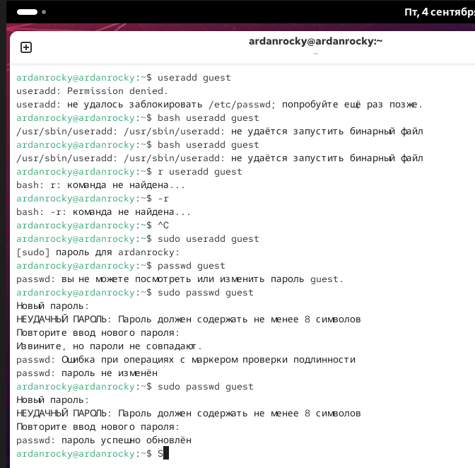

# Цель работы
Получение практических навыков работы в консоли с атрибутами файлов, закрепление теоретических основ дискреционного разграничения доступа в современных системах с открытым кодом на базе ОС Linux1

# Ход работы

- Создание guest
- Создание директории dir1
- Выявление прав
- Заполнение таблички
    

#
 
 
#

 

#
 