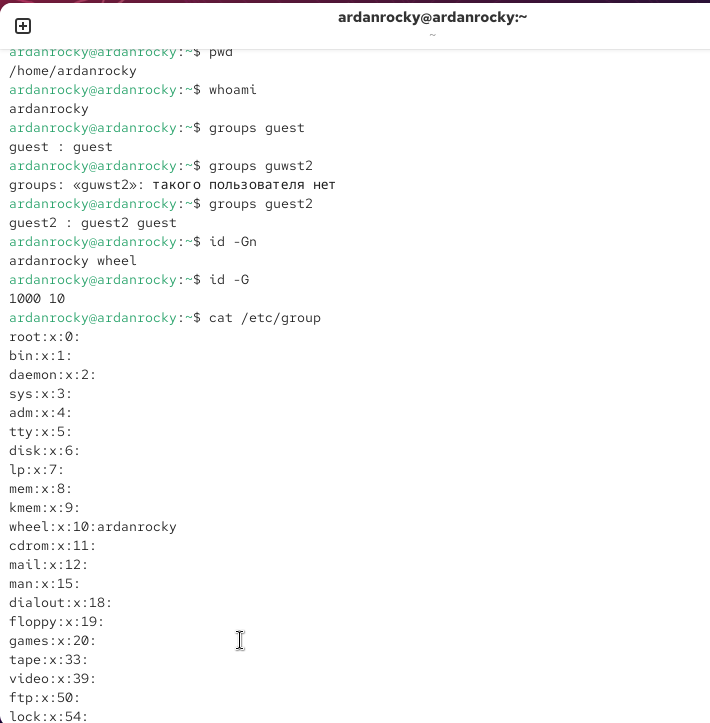
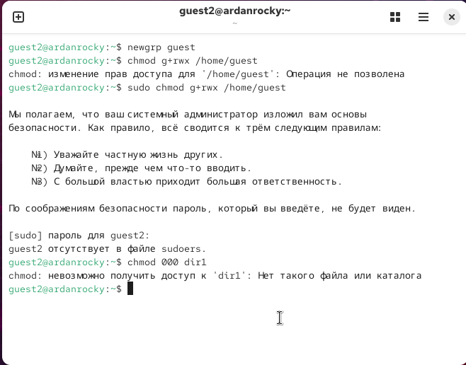

# Титульный лист
## РУДН
### Компьютерные и информационные науки, ФФМИЕН

\newpage

# Цель работы
 Получение практических навыков работы в консоли с атрибутами файлов для групп пользователей


# Порядок выполнения работы
1. В установленной операционной системе создайте учётную запись поль-
зователя guest (использую учётную запись администратора):
useradd guest
2. Задайте пароль для пользователя guest (использую учётную запись ад-
министратора):
passwd guest
3. Аналогично создайте второго пользователя guest2.
4. Добавьте пользователя guest2 в группу guest:
gpasswd -a guest2 guest
5. Осуществите вход в систему от двух пользователей на двух разных кон-
солях: guest на первой консоли и guest2 на второй консоли.
6. Для обоих пользователей командой pwd определите директорию, в кото-
рой вы находитесь. Сравните её с приглашениями командной строки.
7. Уточните имя вашего пользователя, его группу, кто входит в неё
и к каким группам принадлежит он сам. Определите командами
groups guest и groups guest2, в какие группы входят пользовате-
ли guest и guest2. Сравните вывод команды groups с выводом команд
id -Gn и id -G.
8. Сравните полученную информацию с содержимым файла /etc/group.
Просмотрите файл командой
cat /etc/group
9. От имени пользователя guest2 выполните регистрацию пользователя
guest2 в группе guest командой
newgrp guest
10. От имени пользователя guest измените права директории /home/guest,
разрешив все действия для пользователей группы:
chmod g+rwx /home/guest
11. От имени пользователя guest снимите с директории /home/guest/dir1
все атрибуты командой
chmod 000 dirl

# 

# 

## Заполнение таблицы 3.1


| Права директории | Права файла | Создание файла| Удаление файла | Запись в файл | Чтение файла | Смена директории | Просмотр файлов в директории | Переименование файл | Смена атрибутов файла |
|:---------------------|:---------------------|-----|-----|-----|-----|-----|-----|-----|-----|
|```d-------— (000)```|```--------— (000)```| - | - | - | - | - | - | - | - |
|```d-----x-— (010)```|```--------— (000)```| - | - | - | - | - | - | - | + |
|```d----w--— (020)```|```--------— (000)```| - | - | - | - | - | - | - | - |
|```d----wx-— (030)```|```--------— (000)```| + | + | - | - | + | - | + | + |
|```d---r---— (040)```|```--------— (000)```| - | - | - | - | - | + | - | - |
|```d---r-x-— (050)```|```--------— (000)```| - | - | - | - | + | + | - | + |
|```d---rw--— (060)```|```--------— (000)```| - | - | - | - | - | + | - | - |
|```d---rwx-— (070)```|```--------— (000)```| + | + | - | - | + | + | + | + |
|```d-------— (000)```|```------x-— (010)```| - | - | - | - | - | - | - | - |
|```d-----x-— (010)```|```------x-— (010)```| - | - | - | - | - | - | - | + |
|```d----w--— (020)```|```------x-— (010)```| - | - | - | - | - | - | - | - |
|```d----wx-— (030)```|```------x-— (010)```| + | + | - | - | + | - | + | + |
|```d---r---— (040)```|```------x-— (010)```| - | - | - | - | - | + | - | - |
|```d---r-x-— (050)```|```------x-— (010)```| - | - | - | - | + | + | - | + |
|```d---rw--— (060)```|```------x-— (010)```| - | - | - | - | - | + | - | - |
|```d---rwx-— (070)```|```------x-— (010)```| + | + | - | - | + | + | + | + |
|```d-------— (000)```|```-----w--— (020)```| - | - | - | - | - | - | - | - |
|```d-----x-— (010)```|```-----w--— (020)```| - | - | + | - | - | - | - | + |
|```d----w--— (020)```|```-----w--— (020)```| - | - | - | - | - | - | - | - |
|```d----wx-— (030)```|```-----w--— (020)```| + | + | + | - | + | - | + | + |
|```d---r---— (040)```|```-----w--— (020)```| - | - | - | - | - | + | - | - |
|```d---r-x-— (050)```|```-----w--— (020)```| - | - | + | - | + | + | - | + |
|```d---rw--— (060)```|```-----w--— (020)```| - | - | - | - | - | + | - | - |
|```d---rwx-— (070)```|```-----w--— (020)```| + | + | + | - | + | + | + | + |
|```d-------— (000)```|```-----wx-— (030)```| - | - | - | - | - | - | - | - |
|```d-----x-— (010)```|```-----wx-— (030)```| - | - | + | - | - | - | - | + |
|```d----w--— (020)```|```-----wx-— (030)```| - | - | - | - | - | - | - | - |
|```d----wx-— (030)```|```-----wx-— (030)```| + | + | + | - | + | - | + | + |
|```d---r---— (040)```|```-----wx-— (030)```| - | - | - | - | - | + | - | - |
|```d---r-x-— (050)```|```-----wx-— (030)```| - | - | + | - | + | + | - | + |
|```d---rw--— (060)```|```-----wx-— (030)```| - | - | - | - | - | + | - | - |
|```d---rwx-— (070)```|```-----wx-— (030)```| + | + | + | - | + | + | + | + |
|```d-------— (000)```|```----r---— (040)```| - | - | - | - | - | - | - | - |
|```d-----x-— (010)```|```----r---— (040)```| - | - | - | + | + | - | - | + |
|```d----w--— (020)```|```----r---— (040)```| - | - | - | - | - | - | - | - |
|```d----wx-— (030)```|```----r---— (040)```| + | + | - | + | + | - | + | + |
|```d---r---— (040)```|```----r---— (040)```| - | - | - | - | - | + | - | - |
|```d---r-x-— (050)```|```----r---— (040)```| - | - | - | + | + | + | - | + |
|```d---rw--— (060)```|```----r---— (040)```| - | - | - | - | - | + | - | - |
|```d---rwx-— (070)```|```----r---— (040)```| + | + | - | + | + | + | + | + |
|```d-------— (000)```|```----r-x-— (050)```| - | - | - | - | - | - | - | - |
|```d-----x-— (010)```|```----r-x-— (050)```| - | - | - | + | + | - | - | + |
|```d----w--— (020)```|```----r-x-— (050)```| - | - | - | - | - | - | - | - |
|```d----wx-— (030)```|```----r-x-— (050)```| + | + | - | + | + | - | + | + |
|```d---r---— (040)```|```----r-x-— (050)```| - | - | - | - | - | + | - | - |
|```d---r-x-— (050)```|```----r-x-— (050)```| - | - | - | + | + | + | - | + |
|```d---rw--— (060)```|```----r-x-— (050)```| - | -| - | - | - | + | - | - |
|```d---rwx-— (070)```|```----r-x-— (050)```| + | + | - | + | + | + | + | + |
|```d-------— (000)```|```----rw--— (060)```| - | - | - | - | - | - | - | - |
|```d-----x-— (010)```|```----rw--— (060)```| - | - | + | + | - | - | - | + |
|```d----w--— (020)```|```----rw--— (060)```| - | - | - | - | - | - | - | - |
|```d----wx-— (030)```|```----rw--— (060)```| + | + | + | + | + | - | + | + |
|```d---r---— (040)```|```----rw--— (060)```| - | - | - | - | - | + | - | - |
|```d---r-x-— (050)```|```----rw--— (060)```| - | - | + | + | + | + | - | + |
|```d---rw--— (060)```|```----rw--— (060)```| - | - | - | - | - | + | - | - |
|```d---rwx-— (070)```|```----rw--— (060)```| + | + | + | + | + | + | + | + |
|```d-------— (000)```|```----rwx-— (070)```| - | - | - | - | - | - | - | - |
|```d-----x-— (010)```|```----rwx-— (070)```| - | - | + | + | + | - | - | + |
|```d----w--— (020)```|```----rwx-— (070)```| - | - | - | - | - | - | - | - |
|```d----wx-— (030)```|```----rwx-— (070)```| + | + | + | + | + | - | + | + |
|```d---r---— (040)```|```----rwx-— (070)```| - | - | - | - | - | + | - | - |
|```d---r-x-— (050)```|```----rwx-— (070)```| - | - | + | + | + | + | - | + |
|```d---rw--— (060)```|```----rwx-— (070)```| - | - | - | - | - | + | - | - |
|```d---rwx-— (070)```|```----rwx-— (070)```| + | + | + | + | + | + | + | + |


## Заполнение таблицы 3.2

| Операция | Права на директорию | Права на файл |
|------------------------|---------------------------------|---------------------------|
| Создание файла | ```d----wx-— (030)``` | ```--------— (000)``` |
| Удаление файла | ```d----wx-— (030)``` | ```--------— (000)``` |
| Чтение файла | ```d-----x-— (010)``` | ```----r---— (040)``` |
| Запись в файл | ```d-----x-— (010)``` | ```-----w--— (020)``` |
| Переименование файла | ```d----wx-— (030)``` | ```--------— (000)``` |
| Создание поддиректории | ```d----wx-— (030)``` | ```--------— (000)``` |
| Удаление поддиректории | ```d----wx-— (030)``` | ```--------— (000)``` |
