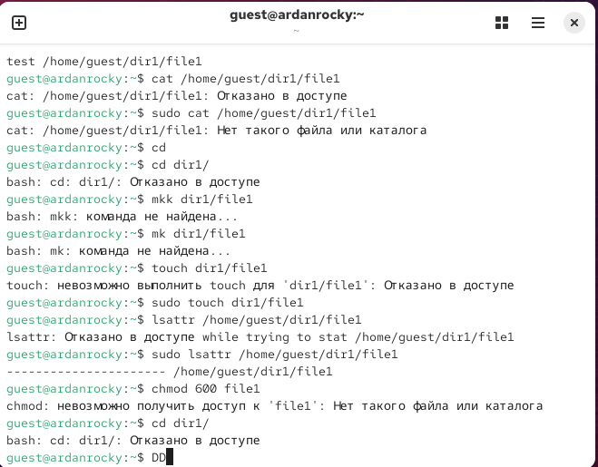
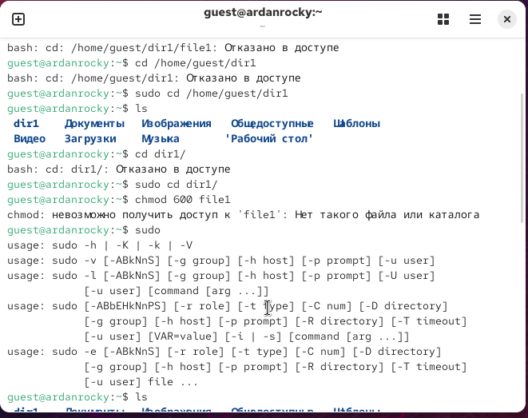
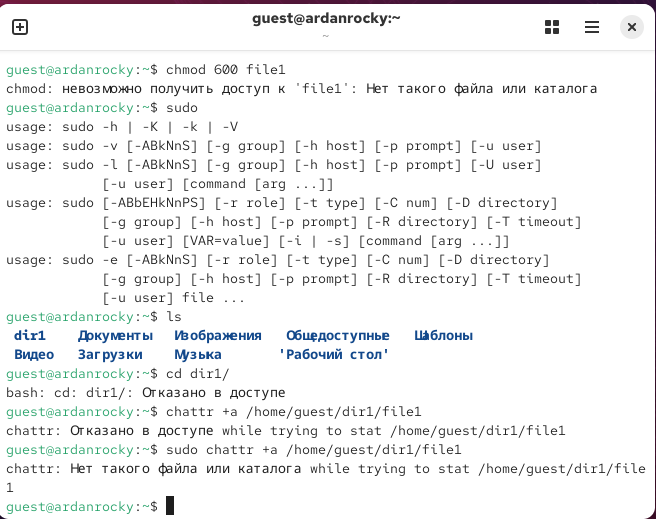

# Титульный лист
## РУДН
### Компьютерные и информационные науки, ФФМИЕН

\newpage

# Цель работы
Получение практических навыков работы в консоли с расширенными атрибутами файлов

# Порядок выполнения работы
1. От имени пользователя guest определите расширенные атрибуты файла
/home/guest/dir1/file1 командой
lsattr /home/guest/dir1/file1
2. Установите командой
chmod 600 file1
на файл file1 права, разрешающие чтение и запись для владельца фай-
ла.
3. Попробуйте установить на файл /home/guest/dir1/file1 расширен-
ный атрибут a от имени пользователя guest:
chattr +a /home/guest/dir1/file1
В ответ вы должны получить отказ от выполнения операции.
4. Зайдите на третью консоль с правами администратора либо повысьте
свои права с помощью команды su. Попробуйте установить расширен-
ный атрибут a на файл /home/guest/dir1/file1 от имени суперполь-
зователя:
chattr +a /home/guest/dir1/file1
5. От пользователя guest проверьте правильность установления атрибута:
lsattr /home/guest/dir1/file1
6. Выполните дозапись в файл file1 слова «test» командой
echo "test" /home/guest/dir1/file1
После этого выполните чтение файла file1 командой
cat /home/guest/dir1/file1
Убедитесь, что слово test было успешно записано в file1.
7. Попробуйте удалить файл file1 либо стереть имеющуюся в нём инфор-
мацию командой
echo "abcd" > /home/guest/dirl/file1
Попробуйте переименовать файл.
8. Попробуйте с помощью команды
1При составлении работы использовались материалы [2—4].
32 Кулябов Д. С., Королькова А. В., Геворкян М. Н.
chmod 000 file1
установить на файл file1 права, например, запрещающие чтение и за-
пись для владельца файла. Удалось ли вам успешно выполнить указан-
ные команды?
9. Снимите расширенный атрибут a с файла /home/guest/dirl/file1 от
имени суперпользователя командой
chattr -a /home/guest/dir1/file1
Повторите операции, которые вам ранее не удавалось выполнить. Ваши
наблюдения занесите в отчёт.
10. Повторите ваши действия по шагам, заменив атрибут «a» атрибутом «i».
Удалось ли вам дозаписать информацию в файл? Ваши наблюдения за-
несите в отчёт.

# 
# 
# 